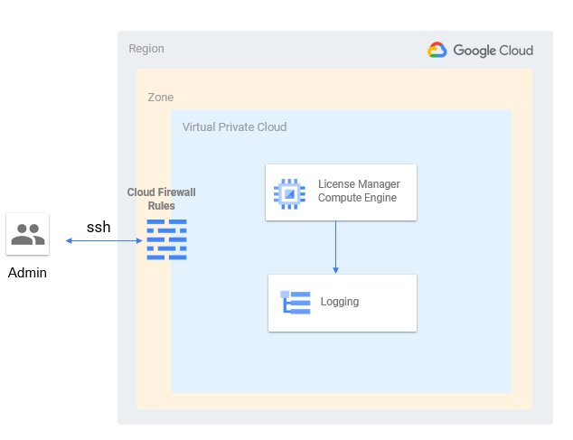

## Setting up a *MATLAB&reg; Network License Manager on Google Cloud Platform&trade; using Terraform&reg;*

Use of MathWorks&reg; products on cloud often requires a license manager within the network to checkout licenses securely. This repository will help in automating the process of launching a network license manager for MATLAB and other toolboxes, running on a Linux virtual machine, on Google Cloud Platform within a Google Cloud&trade; project. For information about the architecture of this solution, see [Learn About Network License Manager for MATLAB Architecture](#architecture-of-a-network-license-manager-setup-on-google-cloud). This repository uses [Terraform to provision Google Cloud resources](https://cloud.google.com/docs/terraform) with declarative configuration files.

### Requirements:

Before [getting started](#getting-started), a user needs:

* MathWorks:
  * A valid MathWorks license for product version **R2020a or later**.
  * To be an administrator of the network license that will be used. This might be necessary to activate the license with the `hostid` or `ip` of the VM which will be eventually hosting the License Manager.
  
For more information on how to configure your license for cloud use, see [MATLAB Licensing in the Cloud](https://www.mathworks.com/help/licensingoncloud/matlab-on-the-cloud.html).

* Google Cloud Platform:
  * Access to Google Cloud [service account](https://cloud.google.com/iam/docs/service-accounts) credentials
  * Access to Google Cloud project
  * Enabled Google Cloud Platform APIs
    * [Google Compute Engine&trade;](https://cloud.google.com/compute)
    * [Google Cloud Storage&trade;](https://cloud.google.com/storage)
    * [Google Cloud Logging&trade;](https://cloud.google.com/logging)
  * Google Cloud SDK [gcloud&trade;](https://cloud.google.com/sdk/gcloud) and [gsutil&trade;](https://cloud.google.com/storage/docs/gsutil) based commands.


                                         
* Terraform: [Terraform is an open source tool that lets you provision Google Cloud resources](https://cloud.google.com/docs/terraform) with declarative configuration files for creating resources.                               
  * Terraform version([v1.0](https://www.terraform.io/upgrade-guides/1-0.html)): Read more on [Installing Terraform](https://learn.hashicorp.com/tutorials/terraform/install-cli).


### Getting started

1. Clone the repository as follows:
```
>> git clone https://github.com/mathworks-ref-arch/network-license-manager-on-gcp-using-terraform.git

```
2. Place valid Google Cloud Service Account credentials within `mathworks-ref-arch/network-license-manager-on-gcp-using-terraform/Software/` directory. A [sample credentials file](Software/credentials.json.template) has been provided as a reference. Configure the `provider` block within `main.tf` to input the credentials file as shown below.
```
# Provider and credentials

provider "google" {
  credentials = file("credentials.json")
  project = var.app_project
  region = var.region
  zone = var.zone
}
```
To get access to valid Google Cloud Service Account credentials, see detailed steps in the following section [Authentication](#authentication). 

3. Deploy the Network License Manager for MATLAB: Configure `variables.tf` with default values for the following list of variables. The below table lists the possible configurations and example values that can be used:
  
|Variable Name|Default Value with examples| Type | Description |Required|
|-------------|-------------|------|-------------------------------------|------|
|app_project | "projectID" | `string`| [Google Cloud project ID](https://cloud.google.com/resource-manager/docs/creating-managing-projects) | `yes` |
|username| "username" | `string`| [User authorized to access the Cloud Platform with Google user credentials](https://cloud.google.com/sdk/gcloud/reference/auth/login)|`yes`|
|gce_ssh_key_file_path|"/home/[username]/.ssh/google_compute_engine.pub"|`string`|Path to public ssh keys for gcloud users. [Locating keys](https://cloud.google.com/compute/docs/instances/adding-removing-ssh-keys#locatesshkeys)|`yes`|
|region|"us-central1"|`string`|Enter cloud region for resource creation|`yes`|
|zone|"us-central1-c"|`string`|Enter cloud zone for resource creation|`yes`|
|machine_types| "n2-standard-4"|`string`|[Google compute machine types](https://cloud.google.com/compute/docs/machine-types#n2_machine_types). See Google cloud [pricing](https://cloud.google.com/compute/vm-instance-pricing) to select a machine_type.|`yes`|
|bootDiskOS|"ubuntu20"|`string`|"Supported OS include: rhel7, rhel8, ubuntu16, ubuntu18, ubuntu20". `bootDiskOS` is by default mapped to existing public images on GCP with the help of two variables `imageProject` and `imageFamily` mentioned below.|`yes`|
|imageProject|<ul><li>`rhel7 = "rhel-cloud"`</li></ul> <ul><li>`rhel8 = "rhel-cloud"`</li></ul> <ul><li>`ubuntu16 = "ubuntu-os-cloud"`</li></ul><ul><li>`ubuntu18 = "ubuntu-os-cloud"`</li></ul><ul><li>`ubuntu20 = "ubuntu-os-cloud"`</li></ul>| `map`|Boot disk images available on GCP are referenced using Image Project and Family.This variable maps the input `bootDiskOS` to default public images using the global ProjectID for the image.|`yes`|
|imageFamily|<ul><li>`rhel7 = "rhel-7"`</li></ul> <ul><li>`rhel8 = "rhel-8"`</li></ul> <ul><li>`ubuntu16 = "ubuntu-1604-lts"`</li></ul> <ul><li>`ubuntu18 = "ubuntu-1804-lts"`</li></ul> <ul><li>`ubuntu20 = "ubuntu-2004-lts"`</li></ul> |`map`| Boot disk images available on GCP are referenced using Image Project and Family.This variable maps the input `bootDiskOS` to default public images using the global image family.|`yes`|
|create_new_vpc|`false`|`bool`|Set this to `true` if new vpc network needs to be created and `false` if an existing one will be used. If this variable is set to `false`, the value for the variable `existing_vpc_network` needs to be set to an existing network name this project has access to. |`yes`|
|existing_vpc_network|"tf-test-network"|`string`|Set the value to an existing VPC network name if `create_new_vpc` is set to `false`.|`yes`|
|network_tags|["mlm","ssh"]|`list`|Provide network firewall tags for applying the rules on target License Manager VM created by the scripts. These network_tags are passed as an input to the module `mlm`|`yes`|
|subnet_create|`false`|`bool`|"User Input stating whether a new subnet needs to be created or an existing subnet needs to be used"|`yes`|
|existing_subnet|"test-tf-subnet"|`string`|Set to existing subnet name if subnet_create set to `false`. Make sure the existing subnet exists within the existing VPC network stated in `existing_vpc_network`|`yes`|
|allowclientip|"172.24.0.0/16"|`string`|Add comma seperated IP Ranges that should be allowed through the firewall|`yes`|
|Version|"R2021a"|`string`|Version of MathWorks product license.|`yes`|
|LicenseHostActivation|"HOSTID"|`string`|Is the license activated with VOL Serial (MAC) or with INTERNET (IP).This variable can take values either `HOSTID` or `INTERNET` only.|`yes`|
|LicenseManagerPort|27000|`number`|Default port for FlexLM service. This port will be open on the firewall to allow traffic requesting for license checkout.|`yes`|
|VendorDaemonPort|1049|`number`|Vendor daemon port is used for communication between the client application and MLM. The port used by MLM is not set by default. When it is not set, the port is chosen randomly.|`yes`|
|tag|"`[username]-mlm-[version]-[date]`"|`string`|A prefix to create cloud resources with unique names|`yes`|

* To get started use the [example script provided](Software/exampleSetUpNetworkLicenseManager.sh) to and test a deployment scenario.
  ```
     >>./Software/exampleSetUpNetworkLicenseManager.sh 
  ```

* Monitor output for the deployment:

|Name|Terraform Resource or Variable | Description|
|----|-------------------|------------|
|version|`var.Version`|MATLAB release selected for license manager setup.|
|compute_zone|`var.zone`|Compute Zone where VM has been deployed.|
|mlm_host_id|`module.mlm_node.mlm_node_private_ip`|Hostname or private IP can be provided to MATLAB  clients. The network license file is configured to checkout licenses from this License manager.|
|mlm_host_name|`module.mlm_node.name`| Hostname for the VM where License Manager is running.|
|mlm_host_port|`var.LicenseManagerPort` |Network License manager listens for license checkout request on this port.|
|subnet_name|<ul><li>`module.mlm_subnet[0].name`</ul></li><ul><li>`data.google_compute_subnetwork.input-subnetwork[0].name`</ul></li>|Name of subnet for the VM. This is either an existing subnet or created as a part of this deployment.|
|vpc_network_name|<ul><li>`module.mlm_vpc_network[0].name`</ul></li><ul><li>`data.google_compute_network.input_vpc_network[0].name`</ul></li>|Name of VPC network for the VM.This is either an existing VPC or one that has been created as a part fo this deployment.|
|license_bucket|`google_storage_bucket.license.name`|Name of the storage bucket used to receive activated license. Upload of a `license.lic` file automatically triggers License Manager restart.|

### Authentication:

In order to make requests against any required Google Cloud Platform API, a user needs to authenticate. The preferred method of provisioning resources with Terraform is to use a Google Cloud [service account](https://cloud.google.com/iam/docs/service-accounts), that can be granted a limited set of IAM permissions scoped out by the platform administrator for the organization.

In order to access user credentials, visit the [service account key page in the Cloud Console](https://console.cloud.google.com/projectselector2/iam-admin/serviceaccounts?supportedpurview=project) and choose an appropriate Google cloud project to list the existing service accounts. A user can either choose an existing service account, or create a new one. [See steps for creating a service account](https://cloud.google.com/docs/authentication/production#create_service_account). Once the user has access to the downloaded JSON key file for the selected service account on the local machine, they can define an environment variable `GOOGLE_APPLICATION_CREDENTIALS` to provide application level access to the credentials. [See instructions for setting the environment variable](https://cloud.google.com/docs/authentication/production#passing_variable).


[For more details, see Terraform documentation on support for adding credentials](https://registry.terraform.io/providers/hashicorp/google/latest/docs/guides/getting_started#adding-credentials).


### Architecture of a Network license manager setup on Google Cloud:



### Resources created by the *reference architecture*:

* Single Google Compute Instance
* VPC network & subnet(optional)
* Firewall Rules allowing traffic to License Manager
* Target tags to apply the Firewall rules to the Google Compute Instance
* Google Cloud Storage bucket to receive license upload post activation
* Google Cloud Storage bucket containing helper scripts (temporary)
  
### Costs

The user is responsible for the cost of the Google cloud services used when they create cloud resources using this guide. Resource settings, such as instance type, will affect the cost of deployment. For cost estimates, see the pricing pages for each Google cloud service being used. Prices are subject to change.

### Quick Links

* [MATLAB License Manager system requirements for selecting Google Compute Instance](https://www.mathworks.com/support/requirements/matlab-system-requirements.html)
* [Starting a License Manager](https://www.mathworks.com/help/install/ug/network-license-manager-tools.html#brk4rvo-3)
* [Managing Network Licenses](https://www.mathworks.com/help/install/ug/network-license-files.html)
* [License Manager Installer](https://www.mathworks.com/support/install/license_manager_files.html)

### License
The license for this reference architecture is available in the [LICENSE.MD](LICENSE.MD) file in this repository. This package uses certain third-party content which is licensed under separate [license agreements](Mozilla_Public_License.txt).

### Enhancement Requests
Provide suggestions for additional features or capabilities using the following link:
https://www.mathworks.com/products/reference-architectures/request-new-reference-architectures.html

### Support
Email: mwlab@mathworks.com

[//]: #  (Copyright 2021 The MathWorks, Inc.)